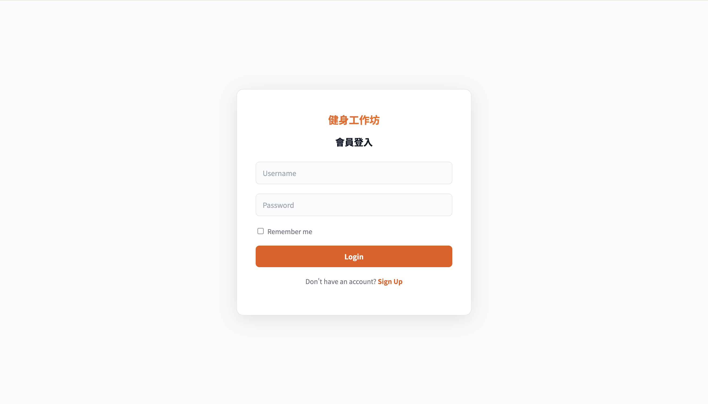
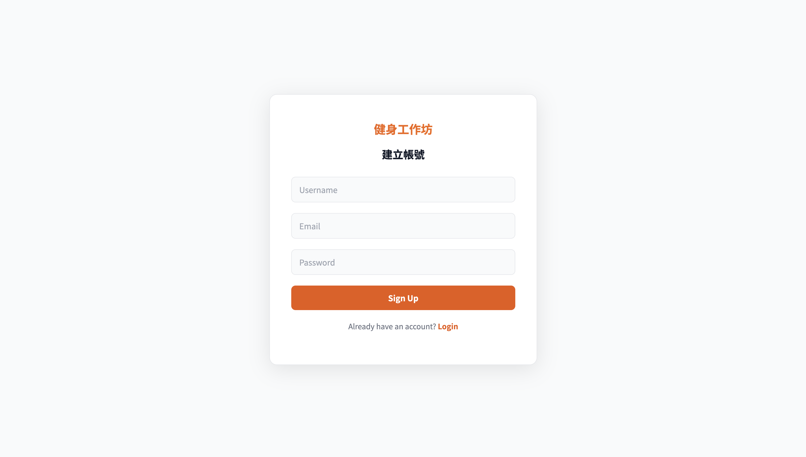
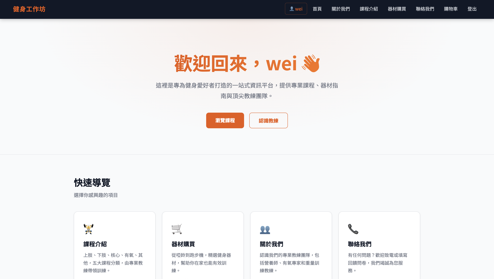
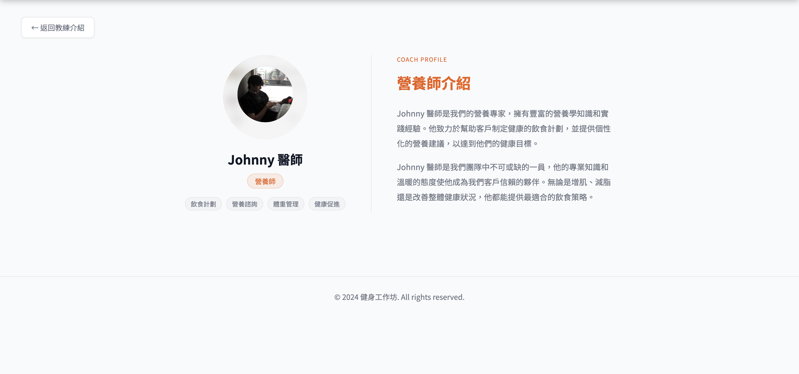
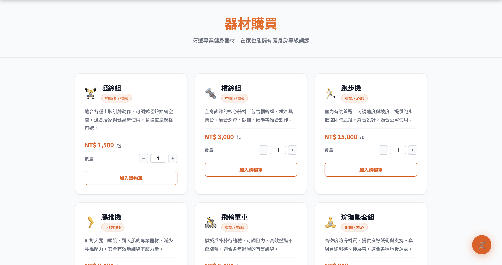
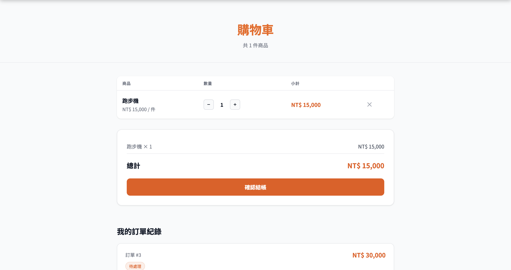
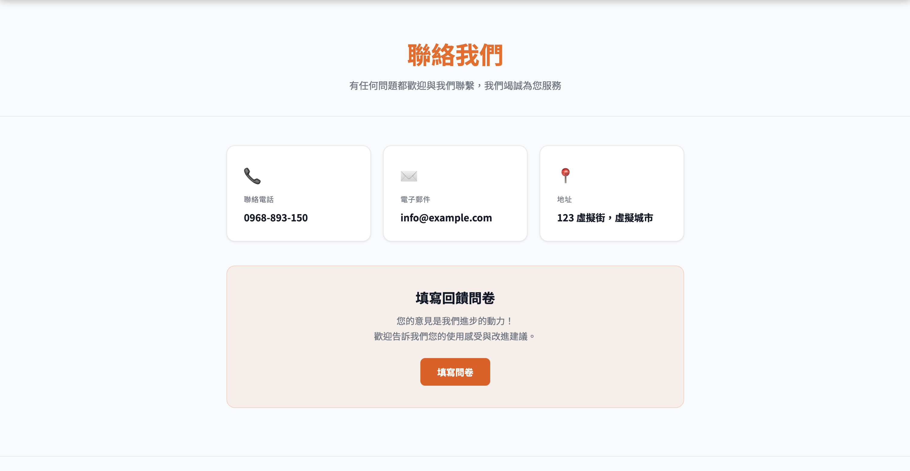
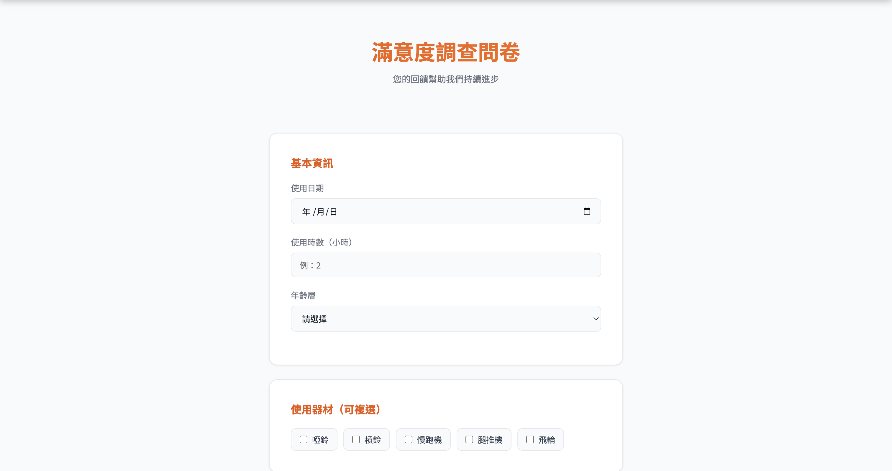

# 🏋️ 健身工作坊 Fitness Workshop

一個以 Node.js + SQLite 為後端、純 HTML/CSS/JS 為前端的全端健身平台。
使用者可以瀏覽課程、購買器材、管理購物車並完成結帳，同時提供完整的會員登入系統與教練介紹頁面。

---

## ✨ 功能特色

### 👤 會員系統
- 註冊帳號（信箱 + 密碼，密碼以 bcrypt 雜湊加密儲存）
- 登入 / 登出，以 session 維持登入狀態（有效期 1 小時）
- 登入後 navbar 顯示目前登入的帳號名稱

### 🏋️ 課程介紹
- 五大課程分類：上肢、下肢、核心、有氧、其他
- 每個分類提供多個詳細課程子頁面，說明動作要領與訓練目標

### 🛒 器材購買與購物車
- 六種健身器材可選購，各有數量選擇器
- 加入購物車時伺服器端驗證定價，防止前端價格竄改
- 同一器材重複加入時自動累加數量（SQLite `ON CONFLICT` upsert）
- 購物車支援：調整數量、移除單項商品、即時更新小計與總金額
- 結帳後彈出「訂單成立」確認視窗，顯示訂單編號
- navbar 購物車圖示即時顯示商品件數紅點

### 📦 訂單紀錄
- 查看個人歷史訂單（訂單編號、總金額、狀態、時間）
- 支援刪除訂單（同步清除訂單明細）

### 👥 教練介紹
- 四位教練各有獨立個人頁面
- 顯示真實照片、專長標籤、詳細介紹

### 📞 聯絡我們
- 聯絡資訊頁面
- 回饋問卷可實際送出並儲存至 SQLite

---

## 📸 頁面截圖

### 登入 / 註冊
| 登入 | 註冊 |
|------|------|
|  |  |

### 首頁 / 關於我們
| 首頁 | 關於我們 |
|------|----------|
|  |  |

### 課程 / 教練
| 課程介紹 | 教練介紹 |
|----------|----------|
|  |  |

### 器材購買 / 購物車
| 器材購買 | 購物車 |
|----------|--------|
|  |  |

### 聯絡我們 / 問卷
| 聯絡我們 | 回饋問卷 |
|----------|----------|
|  |  |

---

## 🛠 技術架構

### 後端
| 技術 | 用途 |
|------|------|
| Node.js | 執行環境 |
| Express | Web 框架、路由處理、靜態檔案服務 |
| SQLite3 | 輕量關聯式資料庫，無需額外伺服器 |
| bcrypt | 密碼雜湊加密（salt rounds: 10） |
| express-session | 登入 session 管理 |

### 前端
| 技術 | 用途 |
|------|------|
| HTML / CSS / JavaScript | 頁面結構、樣式、互動邏輯 |
| Fetch API | 前後端非同步溝通，無需頁面重整 |
| nav.js | 共用導覽列，動態注入至所有頁面 |

---

## 🗄️ 資料庫結構

```sql
-- 使用者
CREATE TABLE user (
  id    INTEGER PRIMARY KEY AUTOINCREMENT,
  帳號  TEXT NOT NULL UNIQUE,
  信箱  TEXT NOT NULL,
  密碼  TEXT NOT NULL          -- bcrypt 雜湊
);

-- 購物車（每位使用者每種器材唯一一筆）
CREATE TABLE cart (
  id    INTEGER PRIMARY KEY AUTOINCREMENT,
  帳號  TEXT NOT NULL,
  器材  TEXT NOT NULL,
  單價  INTEGER NOT NULL,
  數量  INTEGER NOT NULL DEFAULT 1,
  UNIQUE(帳號, 器材)
);

-- 訂單
CREATE TABLE orders (
  id     INTEGER PRIMARY KEY AUTOINCREMENT,
  帳號   TEXT NOT NULL,
  總金額 INTEGER NOT NULL,
  狀態   TEXT NOT NULL DEFAULT '待處理',
  時間   TEXT NOT NULL DEFAULT (datetime('now', 'localtime'))
);

-- 訂單明細
CREATE TABLE order_items (
  id     INTEGER PRIMARY KEY AUTOINCREMENT,
  訂單id INTEGER NOT NULL,
  器材   TEXT NOT NULL,
  數量   INTEGER NOT NULL,
  單價   INTEGER NOT NULL
);
```

---

## 📁 專案結構

```
資料庫專題/
├── README.md
├── public/                        前端頁面與靜態資源
│   ├── nav.js                     共用導覽列（所有頁面動態載入）
│   ├── theme.css                  全站共用健身房風格主題
│   ├── cart.html                  購物車與訂單紀錄
│   ├── equipment.html             器材購買
│   ├── index1.html                關於我們／教練總覽
│   ├── img/                       教練照片
│   │   ├── wei.jpg
│   │   ├── johnny.jpg
│   │   ├── yuchen.jpg
│   │   └── henry.jpg
│   ├── class/                     課程頁面
│   │   ├── course.html            課程總覽
│   │   ├── upper1~3.html          上肢課程
│   │   ├── lower1~3.html          下肢課程
│   │   ├── main1~2.html           核心課程
│   │   ├── air1~2.html            有氧課程
│   │   └── other1~3.html          其他課程
│   ├── coach/                     教練個人頁面
│   │   ├── Ethan.html
│   │   ├── Henry.html
│   │   ├── Johnny.html
│   │   └── Yuchen.html
│   └── connection/                聯絡我們
│       ├── connection1.html
│       └── comment.html
└── server/                        後端
    ├── index.js                   Express 主程式
    ├── package.json
    ├── package-lock.json
    ├── test_user.db               SQLite 資料庫（自動建立）
    └── views/                     首頁與會員頁面
        ├── Login.html
        ├── Sign.html
        └── start1.html            網站首頁
```

---

## 🚀 安裝與執行

**環境需求：** Node.js v18 以上

```bash
# 1. 進入 server 資料夾
cd server

# 2. 安裝相依套件
npm install

# 3. 啟動伺服器
npm start
```

開啟瀏覽器前往 → [http://localhost:3000](http://localhost:3000)

> 首次啟動時會自動建立 `test_user.db` 與所有資料表，無需額外設定。

---

## 👥 開發成員

| 成員 | 負責項目 |
|------|----------|
|  |  |
|  |  |
|  |  |
|  |  |
