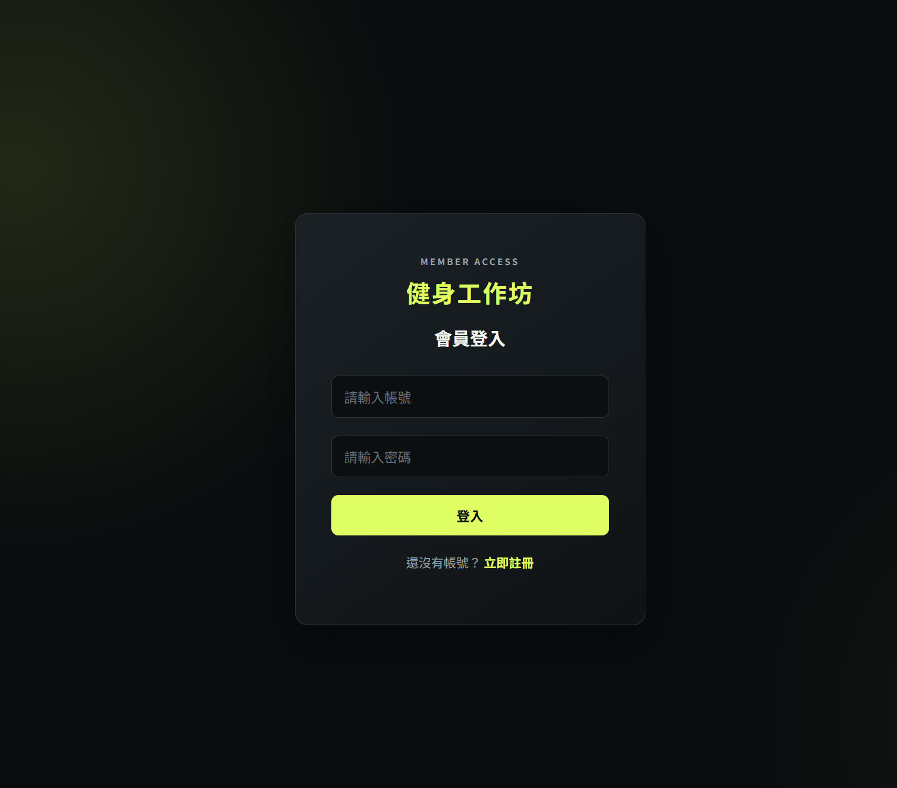
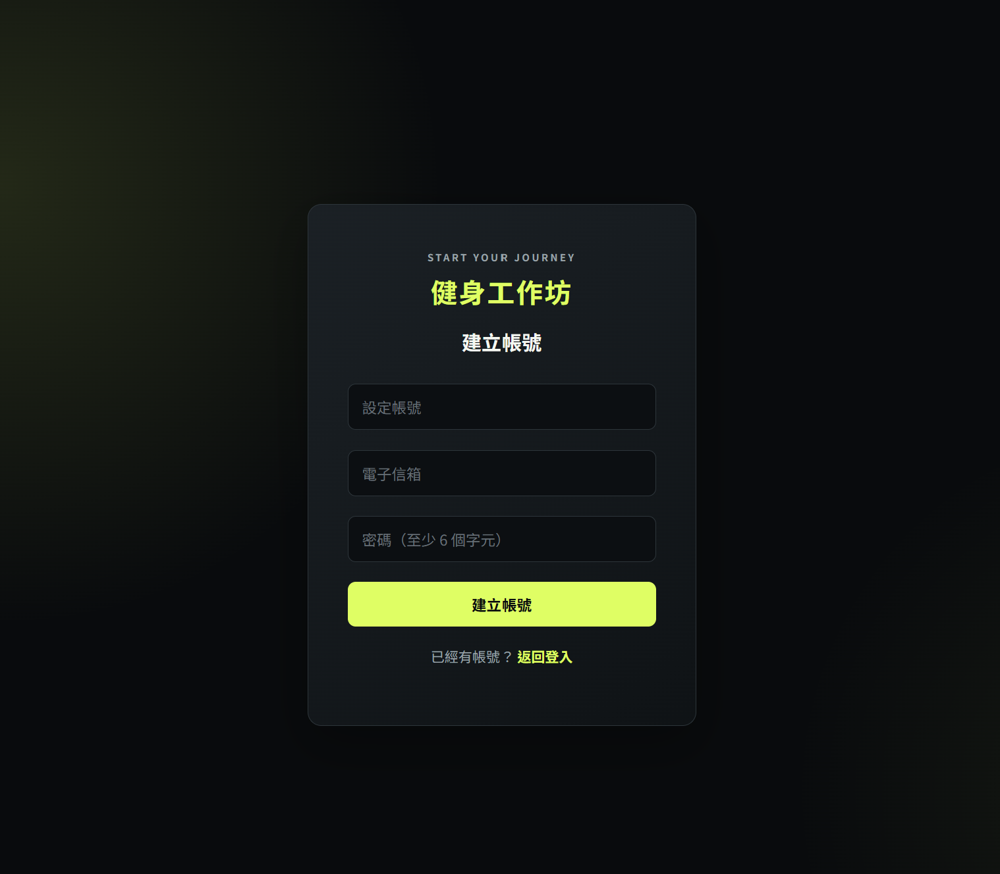
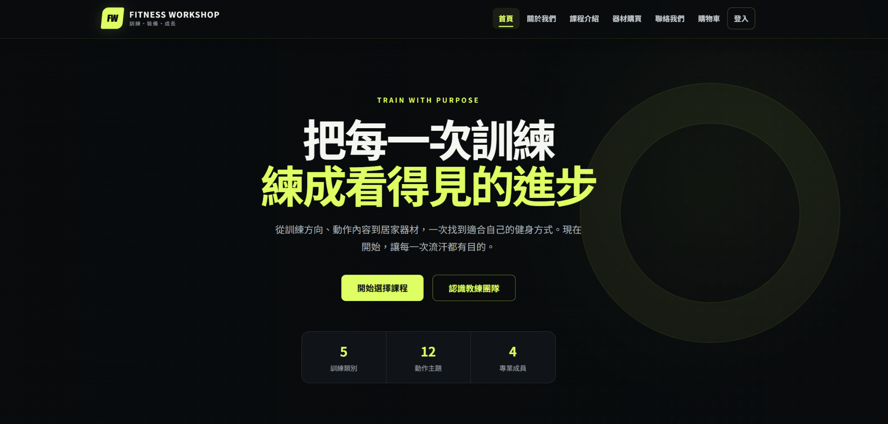
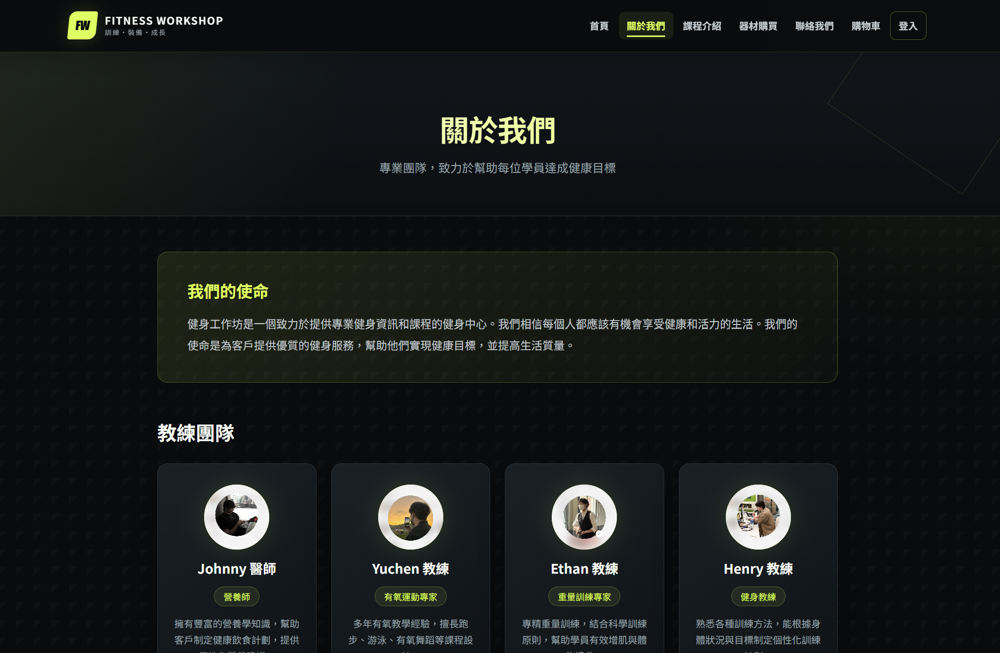
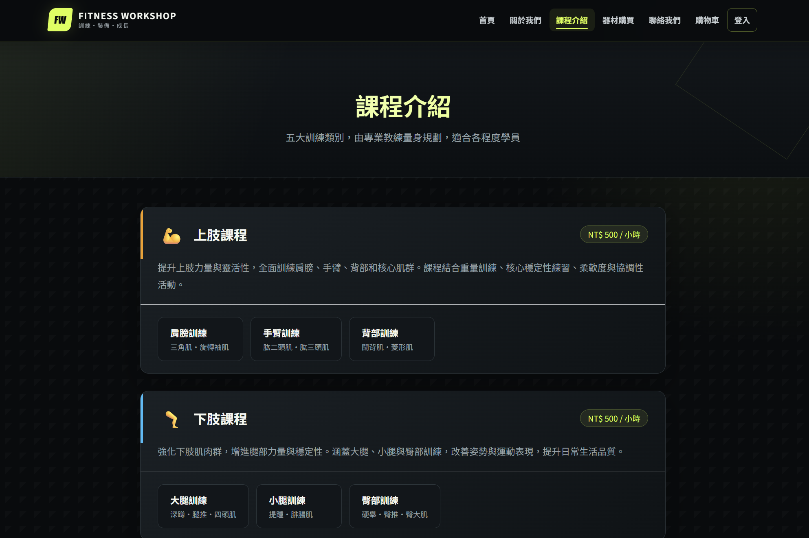
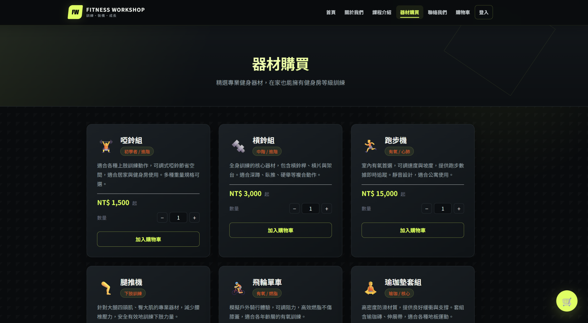
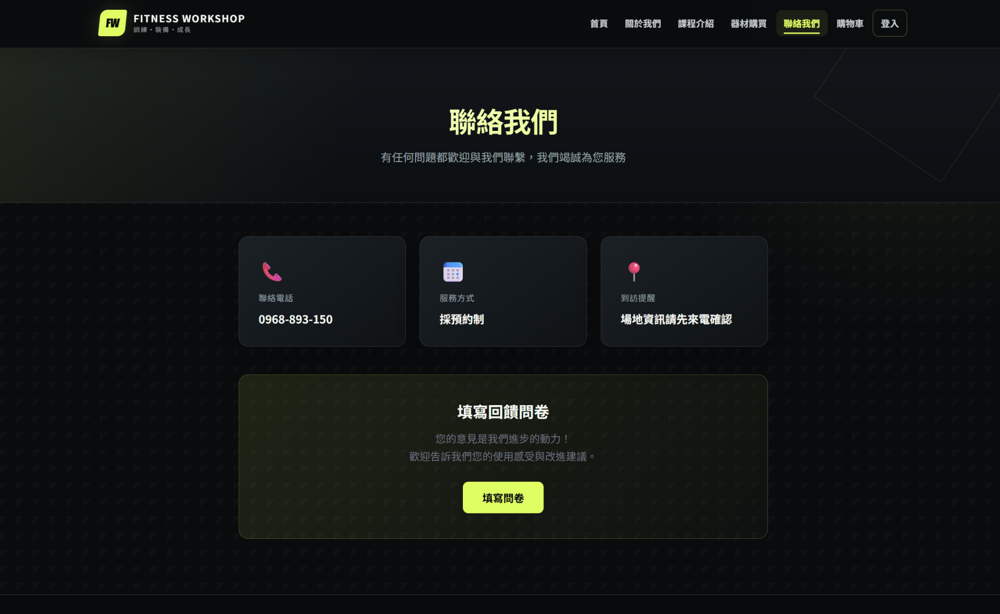
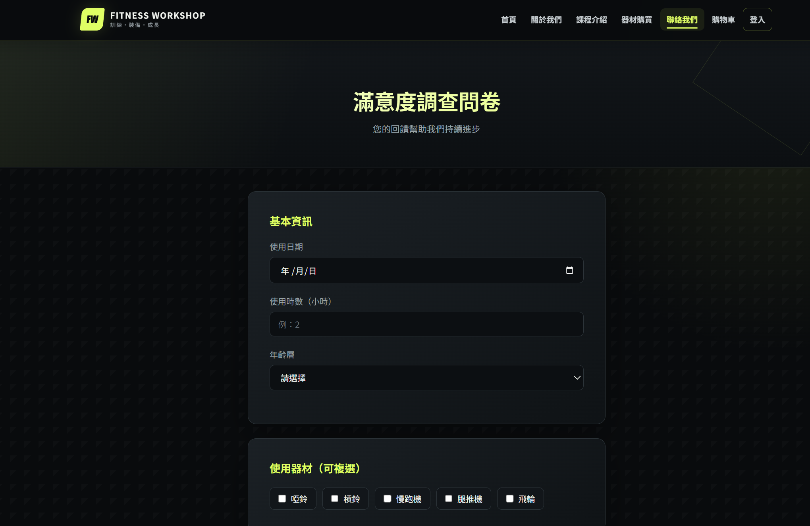

# 🏋️ 健身工作坊 Fitness Workshop

健身工作坊是一個整合 **課程介紹、器材購買、會員管理與回饋問卷** 的全端網站。
後端採用 Node.js、Express 與 SQLite，前端使用 HTML、CSS 與 JavaScript，讓使用者可以瀏覽訓練內容、認識教練、管理購物車、建立訂單並留下使用回饋。

---

## ✨ 功能特色

### 👤 會員系統

- 使用帳號、電子信箱與密碼註冊，並檢查帳號、信箱格式與密碼長度。
- 密碼使用 bcrypt 雜湊儲存，登入時比對雜湊值。
- 透過 express-session 維持登入狀態，Cookie 有效期為 1 小時。
- 登入後導覽列顯示帳號名稱，並提供登出功能。
- 首頁、課程與教練介紹可直接瀏覽；購物車與訂單功能需先登入。

### 🏋️ 課程介紹

- 提供上肢、下肢、核心、有氧與其他五大訓練分類。
- 各分類包含獨立的訓練子頁面，介紹訓練部位、動作與注意事項。
- 課程總覽顯示課程說明、每小時價格與相關訓練入口。

### 🛒 器材購買與購物車

- 提供啞鈴組、槓鈴組、跑步機、腿推機、飛輪單車與瑜珈墊套組六種器材。
- 可先選擇數量，再將器材加入會員購物車。
- 商品單價由伺服器端定價表決定，不採用前端傳入的價格。
- 同一會員重複加入相同器材時會累加數量，上限為 99 件。
- 支援調整商品數量、移除商品，以及更新小計與總金額。
- 結帳時建立訂單與訂單明細、清空購物車，並顯示訂單編號。
- 導覽列與器材頁面的購物車圖示會更新商品件數。

結帳功能用於示範訂單建立流程，目前未串接線上金流。

### 📦 訂單紀錄

- 在購物車頁面查看自己的歷史訂單。
- 顯示訂單編號、總金額、處理狀態與建立時間。
- 可刪除個人訂單，並一併清除對應的訂單明細。
- 購物車與訂單的查詢、修改及刪除皆依目前登入帳號處理。

### 👥 教練介紹

- 關於我們頁面呈現網站理念與教練團隊總覽。
- Johnny、Yuchen、Ethan 與 Henry 各有獨立介紹頁面。
- 透過人物照片、專長標籤與介紹內容，展示不同的訓練與服務方向。

### 📞 聯絡我們與回饋問卷

- 提供聯絡資訊與回饋問卷入口。
- 問卷可填寫使用日期、使用時數、年齡層、使用器材、課程與滿意度。
- 支援器材意見、教練滿意度及其他建議。
- 問卷經由 Fetch API 送至後端，儲存於 SQLite 的 `feedback` 資料表。
- 會員與訪客皆可填寫；會員回饋會記錄帳號，未登入時以「訪客」記錄。

---

## 📸 頁面截圖

### 登入 / 註冊

| 登入 | 註冊 |
| --- | --- |
|  |  |

### 首頁 / 關於我們

| 首頁 | 關於我們 |
| --- | --- |
|  |  |

### 課程 / 器材購買

| 課程介紹 | 器材購買 |
| --- | --- |
|  |  |

### 聯絡我們 / 問卷

| 聯絡我們 | 回饋問卷 |
| --- | --- |
|  |  |

---

## 🛠 技術架構

### 後端

| 技術 | 用途 |
| --- | --- |
| Node.js | 執行伺服器端 JavaScript |
| Express | 路由處理、API 與靜態檔案服務 |
| SQLite3 | 儲存會員、購物車、訂單、訂單明細與回饋資料 |
| bcrypt | 密碼雜湊與登入驗證，salt rounds 為 10 |
| express-session | 管理登入 Session 與 Cookie |

### 前端

| 技術 | 用途 |
| --- | --- |
| HTML / CSS / JavaScript | 頁面結構、版面樣式與互動操作 |
| Fetch API | 會員驗證、購物車、訂單與問卷的非同步資料傳送 |
| `nav.js` | 共用導覽列、登入狀態、購物車件數與行動版選單 |
| `theme.css` | 共用的黑色與螢光綠視覺樣式、響應式版面 |

---

## 🗄️ 資料庫結構

系統使用 SQLite，包含 `user`、`cart`、`orders`、`order_items` 與 `feedback` 五張資料表。下列結構對應 `server/index.js` 中的初始化設定。

```sql
-- 使用者
CREATE TABLE user (
  id    INTEGER PRIMARY KEY AUTOINCREMENT,
  帳號  TEXT NOT NULL UNIQUE,
  信箱  TEXT NOT NULL DEFAULT '',
  密碼  TEXT NOT NULL              -- bcrypt 雜湊
);

-- 購物車（每位會員的同一種器材只保留一筆）
CREATE TABLE cart (
  id    INTEGER PRIMARY KEY AUTOINCREMENT,
  帳號  TEXT NOT NULL,
  器材  TEXT NOT NULL,
  單價  INTEGER NOT NULL,
  數量  INTEGER NOT NULL DEFAULT 1,
  UNIQUE(帳號, 器材)
);

-- 訂單
CREATE TABLE orders (
  id     INTEGER PRIMARY KEY AUTOINCREMENT,
  帳號   TEXT NOT NULL,
  總金額 INTEGER NOT NULL,
  狀態   TEXT NOT NULL DEFAULT '待處理',
  時間   TEXT NOT NULL DEFAULT (datetime('now', 'localtime'))
);

-- 訂單明細
CREATE TABLE order_items (
  id     INTEGER PRIMARY KEY AUTOINCREMENT,
  訂單id INTEGER NOT NULL,
  器材   TEXT NOT NULL,
  數量   INTEGER NOT NULL,
  單價   INTEGER NOT NULL
);

-- 回饋問卷
CREATE TABLE feedback (
  id         INTEGER PRIMARY KEY AUTOINCREMENT,
  帳號       TEXT NOT NULL DEFAULT '訪客',
  使用日期   TEXT,
  使用時數   REAL,
  年齡層     TEXT,
  使用器材   TEXT,
  器材滿意度 TEXT,
  器材意見   TEXT,
  課程       TEXT,
  教練滿意度 TEXT,
  其他意見   TEXT,
  建立時間   TEXT NOT NULL DEFAULT (datetime('now', 'localtime'))
);
```

同一會員的購物車商品透過 `UNIQUE(帳號, 器材)` 避免重複建立，並以 `ON CONFLICT` 更新數量。訂單與明細透過 `orders.id`、`order_items.訂單id` 對應，相關新增與刪除由後端程式處理。

---

## 📁 專案結構

```text
Fitness-Workshop/
├── README.md
├── docs/                         README 展示截圖
│   ├── login.png
│   ├── register.png
│   ├── home.png
│   ├── about.png
│   ├── courses.png
│   ├── equipment.png
│   ├── contact.png
│   └── feedback.png
├── public/                       前端頁面與靜態資源
│   ├── nav.js                    共用導覽列與登入狀態
│   ├── theme.css                 共用主題樣式
│   ├── cart.html                 購物車與訂單紀錄
│   ├── equipment.html            器材購買
│   ├── index1.html               關於我們與教練總覽
│   ├── img/                      人物照片與既有展示圖片
│   ├── class/                    課程介紹與訓練子頁面
│   │   ├── course.html           課程總覽
│   │   ├── upper1～3.html        上肢訓練
│   │   ├── lower1～3.html        下肢訓練
│   │   ├── main1～2.html         核心訓練
│   │   ├── air1～2.html          有氧訓練
│   │   └── other1～3.html        其他訓練
│   ├── coach/                    教練介紹頁面
│   │   ├── Ethan.html
│   │   ├── Henry.html
│   │   ├── Johnny.html
│   │   └── Yuchen.html
│   └── connection/               聯絡與回饋
│       ├── connection1.html
│       └── comment.html
└── server/                       後端
    ├── index.js                  Express 主程式與資料庫初始化
    ├── package.json
    ├── package-lock.json
    ├── Readme.md                 原課程說明
    ├── test_user.db              SQLite 資料庫（啟動時自動建立）
    └── views/                    首頁與會員頁面
        ├── Login.html
        ├── Sign.html
        └── start1.html
```

`upper1～3.html` 等寫法代表同系列的多個檔案。

---

## 🚀 安裝與執行

**環境需求：** Node.js 18 以上、npm。

```bash
# 1. 取得專案並進入 server 資料夾
git clone https://github.com/johnnychan0523/Fitness-Workshop.git
cd Fitness-Workshop/server

# 2. 安裝相依套件
npm ci

# 3. 啟動伺服器
npm start
```

開啟瀏覽器前往 [http://localhost:3000](http://localhost:3000)。

> 首次啟動時會自動建立 `server/test_user.db` 與五張資料表，無需另外啟動資料庫伺服器或執行 SQL 初始化檔案。

可先瀏覽首頁、課程、器材與教練介紹；若要測試購物車與訂單流程，請先註冊帳號並登入。回饋問卷可直接填寫，送出後會儲存至資料庫。
